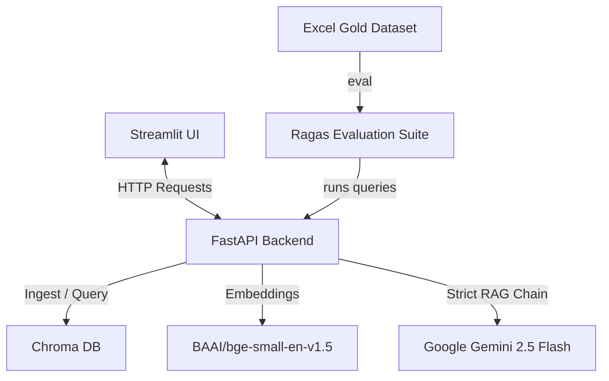

# 💼 RagResume - AI Resume Search Engine

An advanced, production-grade **Retrieval-Augmented Generation (RAG)** application designed to search, query, and analyze candidate resumes with absolute precision. Powered by FastAPI, Streamlit, LangChain, Chroma DB, and Google Gemini.

---

## 🌟 Key Features

- **Strict Retrieval-Augmented Generation (RAG):** Built-in systemic safeguards that strictly prevent LLM hallucinations. If the candidate's resume doesn't contain the requested details, the system responds with a deterministic: *"I do not have enough content to answer this question."*
- **Sleek Glassmorphic UI:** A premium, interactive dark-themed Streamlit user interface featuring clean micro-animations, glassmorphic layouts, and upload utilities.
- **Robust REST API Backend:** Powered by FastAPI for indexing new resumes, searching databases, and querying vectors asynchronously.
- **Embedded Similarity Search:** Leverages `BAAI/bge-small-en-v1.5` embeddings via HuggingFace for state-of-the-art semantic search, backed by a persistent Chroma vector database.
- **Automated Ragas Evaluation:** Integrates a testing suite (`evaluate_rag.py`) that evaluates RAG performance (Faithfulness, Answer Relevancy, Context Precision, and Context Recall) against ground truth test sets.

---

## 🛠️ Architecture & Tech Stack



- **LLM Engine:** Gemini 2.5 Flash (`gemini-2.5-flash`) with deterministic temperature configuration.
- **Vector Database:** Chroma DB (`chroma.db`) for high-performance vector index storage.
- **Frameworks:** LangChain, FastAPI, Streamlit, Ragas.
- **Embeddings:** HuggingFace Embeddings (`BAAI/bge-small-en-v1.5`).

---

## 📁 Repository Structure

```text
├── ingestion/
│   ├── document_loader.py    # Extracts text and metadata from PDF files
│   └── embeddings.py         # Creates vector representations and saves to Chroma
├── data/                     # Source directory containing initial resume data
├── Resumes/                  # Working folder where uploaded resumes are stored
├── chroma.db/                # Persistent directory for the local vector database
├── app.py                    # Streamlit premium dashboard UI code
├── main.py                   # FastAPI REST API Backend
├── pipeline.py               # Standalone console RAG test pipeline script
├── evaluate_rag.py           # Evaluation framework for calculating RAGAS metrics
├── Rag_Resumes (Responses).xlsx # Gold dataset containing sample queries and expected answers
├── requirements.txt          # Python dependencies
└── .env                      # Environment configuration variables
```

---

## 🚀 Quick Start Guide

### 1. Prerequisites & Setup

Ensure you have python 3.9+ installed. Clone the repository and install dependencies:

```bash
pip install -r requirements.txt
```

### 2. Configure Environment Variables

Create a `.env` file in the root of the project:

```env
GOOGLE_API_KEY=your_gemini_api_key_here
PORT=8000
HOST=127.0.0.1
```

### 3. Run the Backend API

Start the FastAPI server:

```bash
python main.py
```
*The API documentation will be available at `http://127.0.0.1:8000/docs`.*

### 4. Run the Streamlit Dashboard

In a new terminal window, run:

```bash
streamlit run app.py
```
*Open `http://localhost:8501` to access the interactive web interface.*

---

## 📊 Evaluation & Validation

This project includes a dedicated evaluation pipeline using the **Ragas** framework. To run evaluation against the gold dataset:

```bash
python evaluate_rag.py
```

It validates:
1. **Faithfulness:** If the answer is purely derived from the retrieved documents.
2. **Answer Relevancy:** How pertinent the generated answer is to the original question.
3. **Context Recall/Precision:** Quality and completeness of the retrieved search contexts.

Results are automatically saved to `ragas_evaluation_results.csv` and error reports to `ragas_evaluation_errors.csv`.

---

## 📄 License
This project is proprietary and confidential. All rights reserved.
